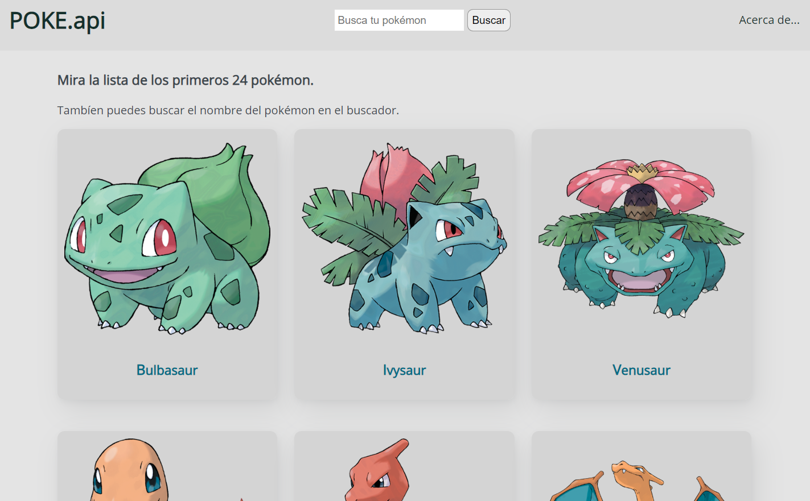
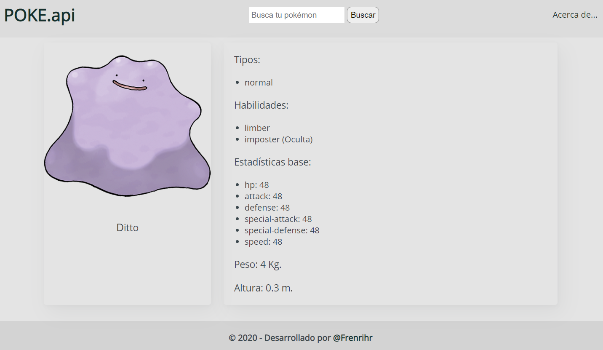

# POKE.api

Esta es una Single Single Page Application con JavaScript Vanilla, la cual permite renderizar los primeros 24 pokémon y sus principales datos. Adicionalmente se puede buscar cualquier pokémon mediante un buscador.

### [Live Demo](https://frenrihrcode.github.io/pokeapi/)
#### Imágenes de muestra



## Instalación
Una vez clones este repositorios ejecuta los siguientes comandos:

```bash
npm install
npm run start
# también puedes usar yarn
yarn install
yarn run start
```
Para desplegar la aplicación ejecuta el comando:

```bash
npm run build
# yarn
yarn run build
```

## Importante

La aplicación ya cuenta con un flujo de GitHub actions para poder desplegar automáticamente en GitHub Pages:
#### Es necesario tener una rama llamada gh-pages (si no la tienes créala).
Para más información visita [Deploy to GitHub Pages](https://github.com/marketplace/actions/deploy-to-github-pages). Del cual me base para crear la configuración.

## Licencia
[MIT](https://choosealicense.com/licenses/mit/)